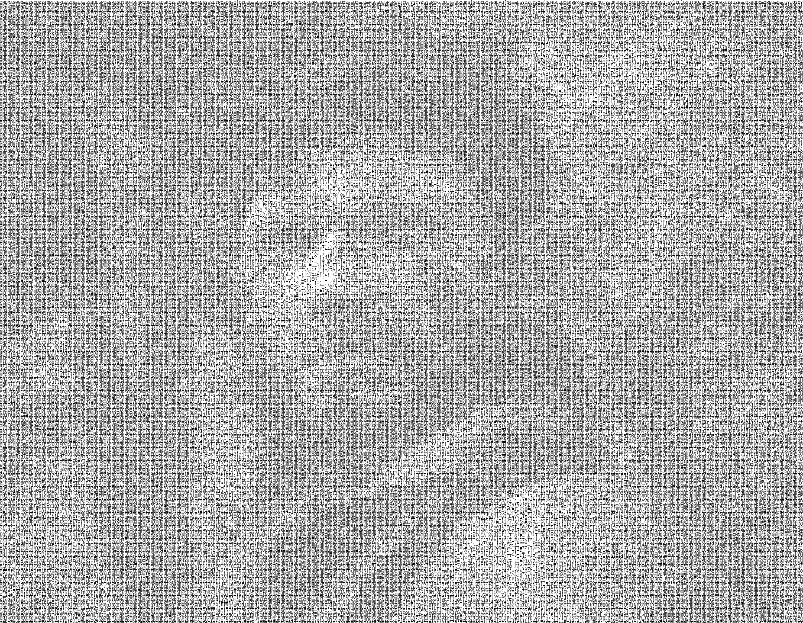

# Image to ASCII art Converter #

This is one of my first projects made in Python, done back in 2015~2016 when I still didn't have much knowledge about organization and optimization. So keep this in mind before you look at the code.

It uses Python 2.7 and PIL to create a text ASCII art of the image. The output can change by changing the settings inside the code.

The settings allow to:

- Change the font used;
- Change the pixel to letter ratio;
- Change the space around each letter;
- Specify if the output is colored using the initial image or if it is monochromatic.

## How it works ##

On the basics it works just like any IMG to ASCII converter: uses [pixel density](https://en.wikipedia.org/wiki/Pixel_density) to diferentiate lighter letters from darker letters. 

1. Resizes the image using the specified ratio.
2. Creates a black and white copy of the resized image.
3. Creates the output white image, using the letter size to calculate the resolution.
4. Then iterates over each pixel of the image, comparing its gray scale value with the letters vector.
5. Having the letter corresponding to the grey value, take the color of the pixel in the original image and write that letter with the original color in the white image.
6. Saves the image with the original name, plus the "_ascii" suffix.

## Usage ##

```
python img-to-ascii.py <name of the image>
```

## Results ##

- Font: `Anonymous.ttf`
- Resize ratio: `1:1`
- Letter Spacing: `1px`
- Monochrome Color: `(0, 0, 0)`

### Initial image `[309 x 240]` ###


### Colored ASCII result image `[1854 x 1440]` ###


### Monochrome ASCII result image `[1854 x 1440]` ###
